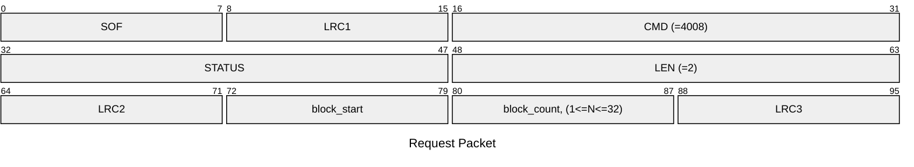
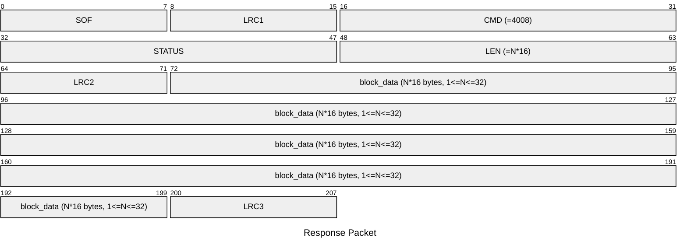

# 4008: MF1_READ_EMU_BLOCK_DATA

* CLI: cf `hf mf eread`

## Request Packet

* DATA in Request Packet
    * block_start: `1 byte`. Start block number.
    * block_count: `1 byte, (1<=N<=32)`. Number of blocks to read.

## Response Packet

* DATA in Response Packet
    * block_data: `N*16 bytes`. The block data read from the emulator.