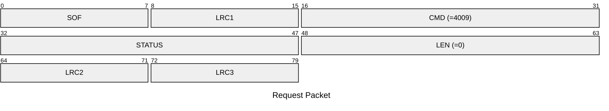
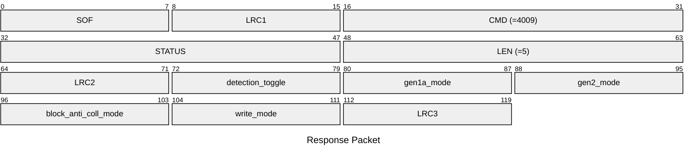

# 4009: MF1_GET_EMULATOR_CONFIG

* CLI: cf `hf mf econfig`

## Request Packet

* DATA in Request Packet: None

## Response Packet

* DATA in Response Packet
  * detection_toggle: cf [MF1_GET_DETECTION_ENABLE](#4007-mf1_get_detection_enable)
  * gen1a_mode: cf [MF1_GET_GEN1A_MODE](#4010-mf1_get_gen1a_mode)
  * gen2_mode: cf [MF1_GET_GEN2_MODE](#4012-mf1_get_gen2_mode)
  * block_anti_coll_mode: cf [MF1_GET_BLOCK_ANTI_COLL_MODE](#4014-mf1_get_block_anti_coll_mode)
  * write_mode: cf [MF1_GET_WRITE_MODE](#4016-mf1_get_write_mode)