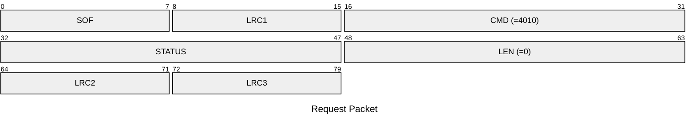
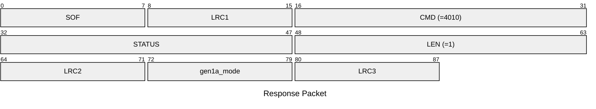

# 4010: MF1_GET_GEN1A_MODE

Get the Mifare Classic emulator is emulating gen1a magic tag or not.

## Request Packet

* DATA in Request Packet: None

## Response Packet

* DATA in Response Packet
    * gen1a_mode: `1 byte`. Whether to emulate the Gen1A magic tag or not for the actived slot.