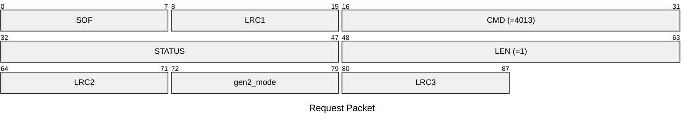
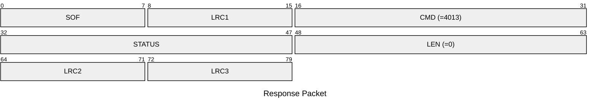

# 4013: MF1_SET_GEN2_MODE

Set the Mifare Classic emulator to emulate gen2 magic tag or not.

* CLI: cf `hf mf econfig`

## Request Packet

* DATA in Request Packet
    * gen2_mode: `1 byte`. Whether to emulate the Gen2 magic tag or not for the actived slot.

## Response Packet

* DATA in Response Packet: None