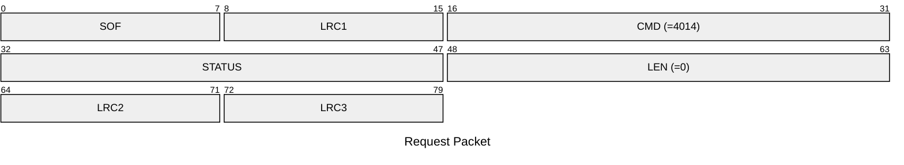
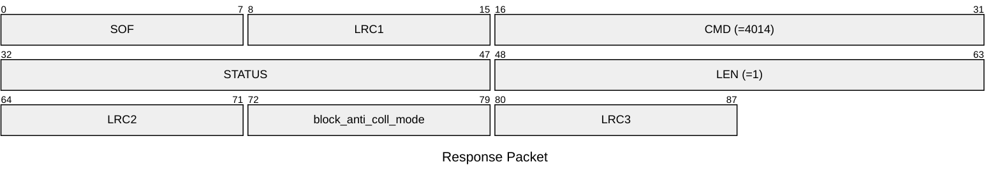

# 4014: MF1_GET_BLOCK_ANTI_COLL_MODE

Get the toggle whether to use anti-collision data from emulator block 0 or not.

## Request Packet

* DATA in Request Packet: None

## Response Packet

* DATA in Response Packet
    * block_anti_coll_mode: `1 byte`. Whether to use anti-collision data from emulator block 0 or not for the actived slot.