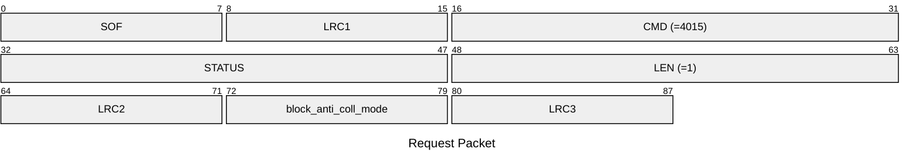
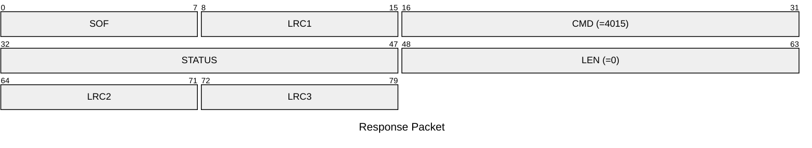

# 4015: MF1_SET_BLOCK_ANTI_COLL_MODE

* CLI: cf `hf mf econfig`

## Request Packet

* DATA in Request Packet
    * block_anti_coll_mode: `1 byte`. Whether to use anti-collision data from emulator block 0 or not for the actived slot.

## Response Packet

* DATA in Response Packet: None