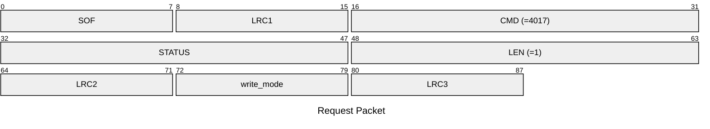
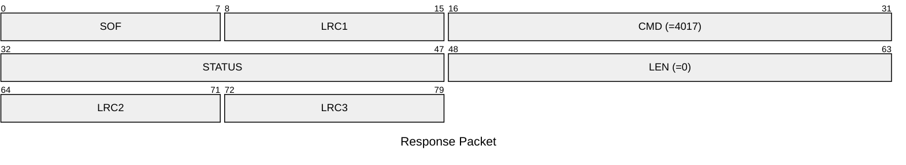

# 4017: MF1_SET_WRITE_MODE

Set the write protect mode of Mifare Classic emulator.

* CLI: cf `hf mf econfig`

## Request Packet

* DATA in Request Packet
    * write_mode: `1 byte`. The write protect mode of Mifare Classic emulator for the actived slot. Please refer to `nfc_tag_mf1_write_mode_t` aka `MifareClassicWriteMode` enum.

## Response Packet

* DATA in Response Packet: None