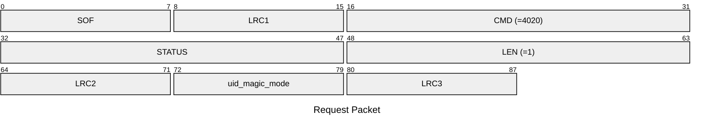
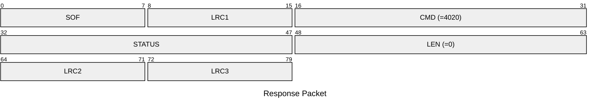

# 4020: MF0_NTAG_SET_UID_MAGIC_MODE

Set the NTAG emulator to emulate UID magic tag or not.

* CLI: cf `hf mfu econfig --enable-uid-magic`/`hf mfu econfig --disable-uid-magic`

## Request Packet

* DATA in Request Packet
    * uid_magic_mode: `1 byte`. Whether to emulate the UID magic tag or not for the actived slot.

## Response Packet

* DATA in Response Packet: None