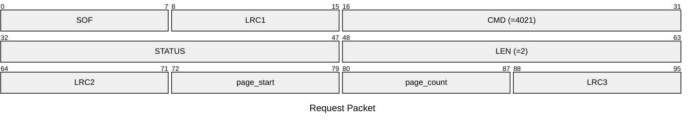
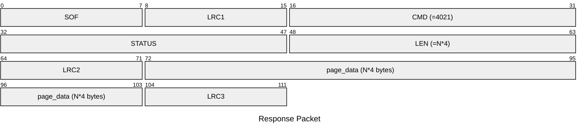

# 4021: MF0_NTAG_READ_EMU_PAGE_DATA

Read page data from NTAG emulator.

* CLI: cf `hf mfu eview`

## Request Packet

* DATA in Request Packet
    * page_start: `1 byte`. The first page index to read from the emulator.
    * page_count: `1 byte`. The number of pages to read from the emulator.

## Response Packet

* DATA in Response Packet
    * page_data: `N*4 bytes`. The page data read from the emulator.