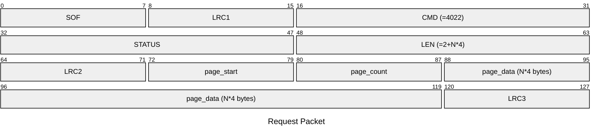
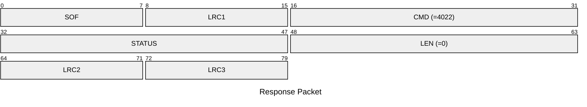

# 4022: MF0_NTAG_WRITE_EMU_PAGE_DATA

## Request Packet

* DATA in Request Packet
    * page_start: `1 byte`. The first page index to write to the emulator.
    * page_count: `1 byte`. The number of pages to write to the emulator.
    * page_data: `N*4 bytes`. The page data to be written to the emulator.

## Response Packet

* DATA in Response Packet: None