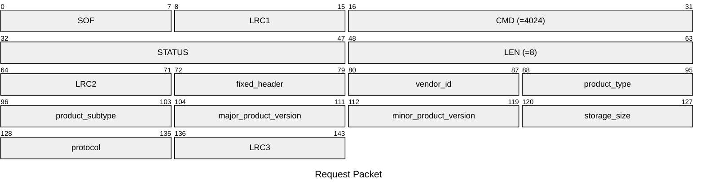
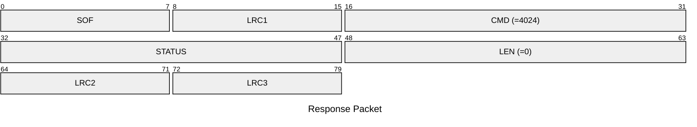

# 4024: MF0_NTAG_SET_VERSION_DATA

Set NTAG version to NTAG emulator.

* CLI: cf `hf mfu econfig --set-version <hex>`

## Request Packet

* DATA in Request Packet
    * fixed_header: `1 byte`. Fixed header byte of NTAG version data.
    * vendor_id: `1 byte`. Vendor ID of NTAG.
    * product_type: `1 byte`. Product type of NTAG.
    * product_subtype: `1 byte`. Product subtype of NTAG.
    * major_product_version: `1 byte`. Major product version of NTAG.
    * minor_product_version: `1 byte`. Minor product version of NTAG.
    * storage_size: `1 byte`. Storage size of NTAG.
    * protocol: `1 byte`. Protocol of NTAG.

### NTAG version for NTAG213, NTAG215 and NTAG216

| Byte no. | Description | NTAG213 | NTAG215 | NTAG216 | Interpretation |
| --- | --- | --- | --- | --- | --- |
| 0 | fixed Header | 0x00 | 0x00 | 0x00 |  |
| 1 | vendor ID | 0x04 | 0x04 | 0x04 | NXP Semiconductors |
| 2 | product type | 0x04 | 0x04 | 0x04 | NTAG |
| 3 | product subtype | 0x02 | 0x02 | 0x02 | 50 pF |
| 4 | major product version | 0x01 | 0x01 | 0x01 | 1 |
| 5 | minor product version | 0x00 | 0x00 | 0x00 | V0 |
| 6 | storage size | 0x0F | 0x11 | 0x13 | [reference](https://www.nxp.com/docs/en/data-sheet/NTAG213_215_216.f#page=36) |
| 7 | protocol | 0x03 | 0x03 | 0x03 | ISO/IEC 14443-3 compliant |

## Response Packet

* DATA in Response Packet: None