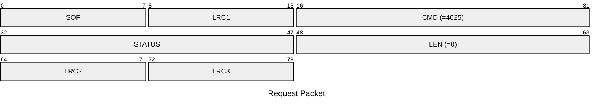
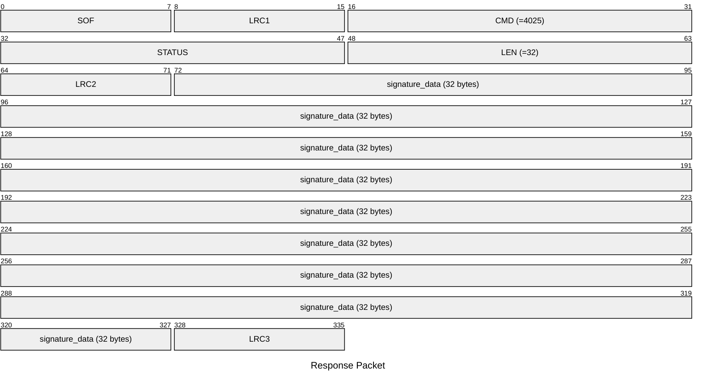

# 4025: MF0_NTAG_GET_SIGNATURE_DATA

* CLI: cf `hf mfu econfig`

## Request Packet

* DATA in Request Packet: None

## Response Packet

* DATA in Response Packet
    * signature_data: `32 bytes`. Signature data bytes.