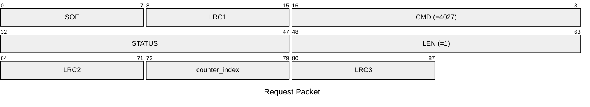
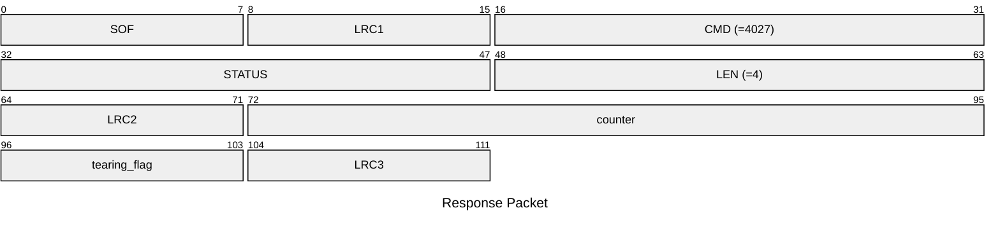

# 4027: MF0_NTAG_GET_COUNTER_DATA

Get counter from NTAG emulator.

* CLI: cf `hf mfu ercnt`

## Request Packet

* DATA in Request Packet
    * counter_index: `1 byte`. Index of the counter to read. Available value: `0`, `1`, `2`.

## Response Packet

* DATA in Response Packet
    * counter: `3 bytes`, U24 in network byte order. The counter value in emulator.
    * tearing_flag: `1 byte`. `0xBD` means tearing flag is not set.