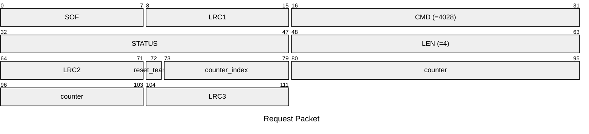
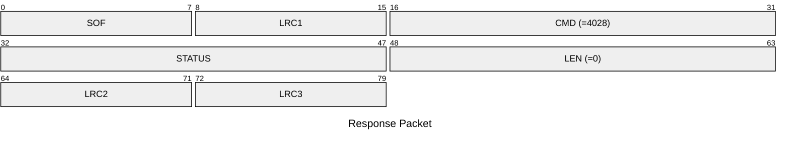

# 4028: MF0_NTAG_SET_COUNTER_DATA

Set counter to NTAG emulator.

* CLI: cf `hf mfu ewcnt`

## Request Packet

* DATA in Request Packet
    * reset_tearing: `1 byte`. `0b1` indicates to reset the tearing event flag.
    * counter_index: `7 bits`. Index of the counter to set. Available value: `0`, `1`, `2`.
    * counter: `3 bytes`, U24 in network byte order. The counter value to set.

## Response Packet

* DATA in Response Packet: None