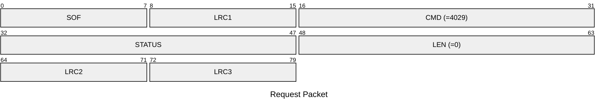
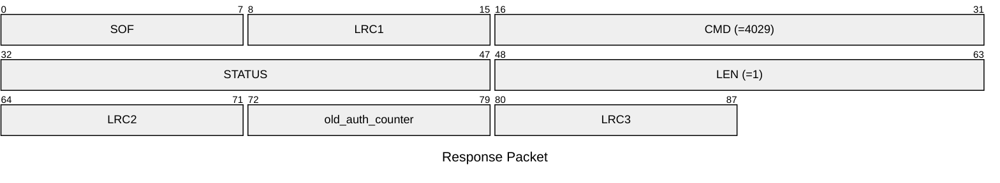

# 4029: MF0_NTAG_RESET_AUTH_CNT

Reset AUTH counter of NTAG emulator.

* CLI: cf `hf mfu econfig --reset-auth-cnt`

## Request Packet

* DATA in Request Packet: None

## Response Packet

* DATA in Response Packet
    - old_auth_counter: `1 byte`. The old value of the unsuccessful auth counter.