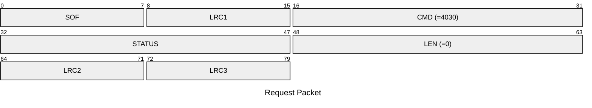
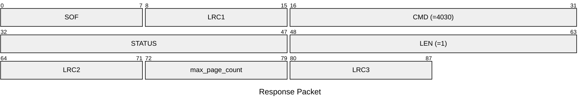

# 4030: MF0_NTAG_GET_PAGE_COUNT

## Request Packet

* DATA in Request Packet: None

## Response Packet

* DATA in Response Packet
    * max_page_count: `1 byte`. The maximum page count of the current tag type in actived slot.