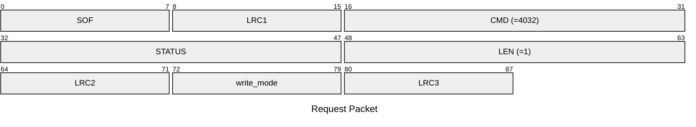
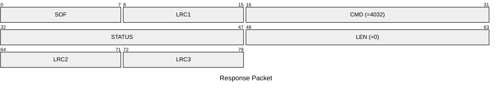

# 4032: MF0_NTAG_SET_WRITE_MODE

Set the protected mode of writing to NTAG emulator.

## Request Packet

* DATA in Request Packet
    * write_mode: `1 byte`. The write protect mode of Mifare Ultralight emulator for the actived slot. Please refer to `nfc_tag_mf0_ntag_write_mode_t` aka `MifareUltralightWriteMode` enum.

## Response Packet

* DATA in Response Packet: None