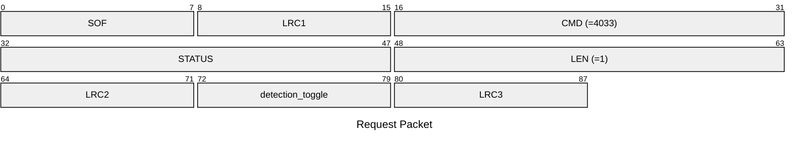
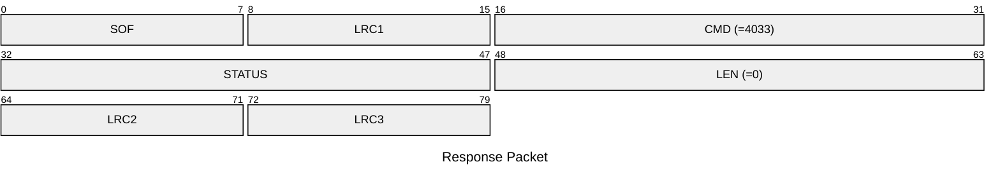

# 4033: MF0_NTAG_SET_DETECTION_ENABLE

Enable/disable the AUTH logger of NTAG emulator.

## Request Packet

* DATA in Request Packet
    * detection_toggle: `1 byte`. Enable or disable the AUTH logger of NTAG emulator.

## Response Packet

* DATA in Response Packet: None