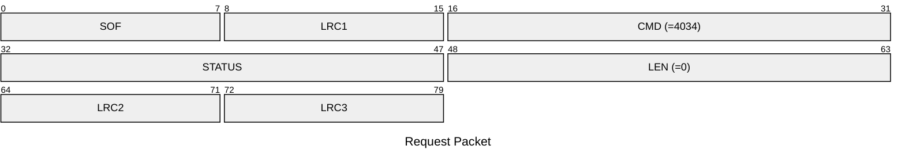
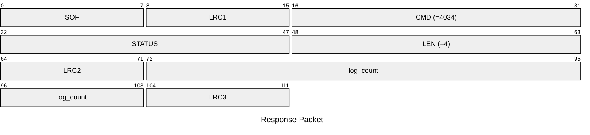

# 4034: MF0_NTAG_GET_DETECTION_COUNT

Get the AUTH log count of NTAG emulator.

## Request Packet

* DATA in Request Packet: None

## Response Packet

* DATA in Response Packet
    * log_count: `4 bytes`. The AUTH log count of NTAG emulator.