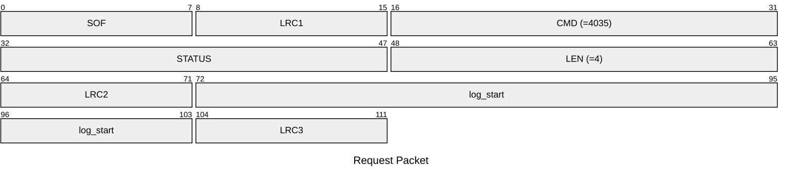
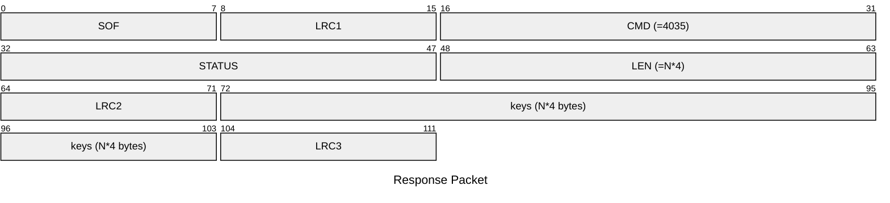

# 4035: MF0_NTAG_GET_DETECTION_LOG

Get the AUTH log of NTAG emulator.

## Request Packet

* DATA in Request Packet
    * log_start: `4 bytes`, U32 in network byte order. The start index of logged AUTH keys to read.

## Response Packet

* DATA in Response Packet
    * keys: `4 bytes/key`, U32 in network byte order. The logged AUTH keys.