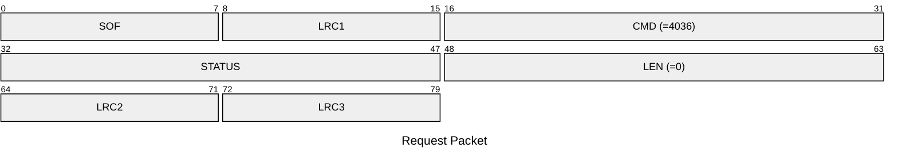
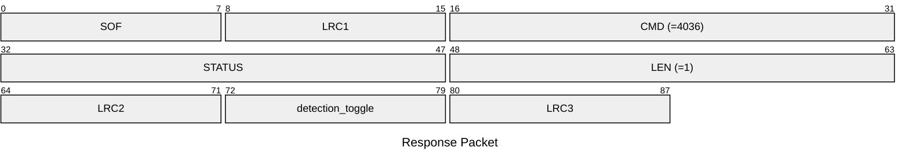

# 4036: MF0_NTAG_GET_DETECTION_ENABLE

Get the AUTH logger of NTAG emulator is enabled or not.

## Request Packet

* DATA in Request Packet: None

## Response Packet

* DATA in Response Packet
    * detection_toggle: `1 byte`. The AUTH logger of NTAG emulator is enabled or not.