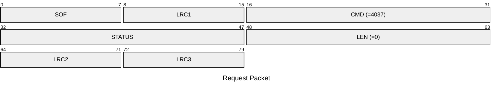
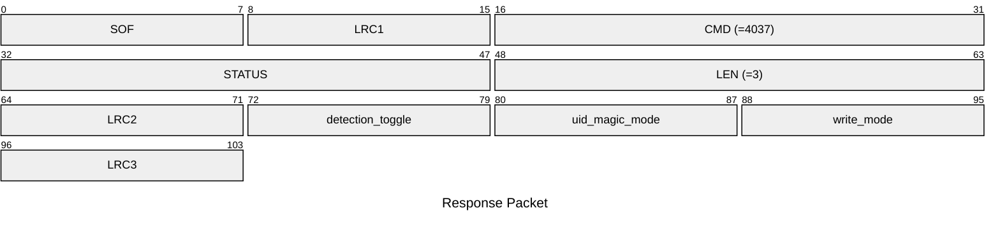

# 4037: MF0_NTAG_GET_EMULATOR_CONFIG

Get configuration of NTAG emulator.

## Request Packet

* DATA in Request Packet: None

## Response Packet

* DATA in Response Packet
    * detection_toggle: `1 byte`. The AUTH logger of NTAG emulator is enabled or not.
    * uid_magic_mode: `1 byte`. Whether to emulate the UID magic tag or not for the actived slot.
    * write_mode: `1 byte`. The write protect mode of Mifare Ultralight emulator for the actived slot. Please refer to `nfc_tag_mf0_ntag_write_mode_t` aka `MifareUltralightWriteMode` enum.