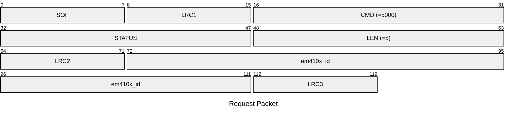
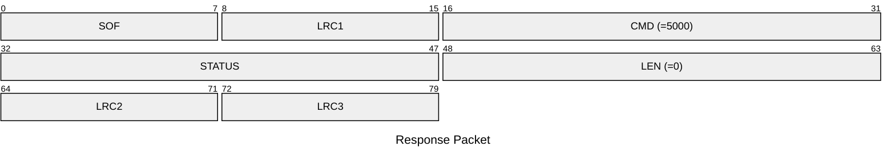

# 5000: EM410X_SET_EMU_ID

Set EM410x ID to emulator.

* CLI: cf `lf em 410x econfig`

## Request Packet

* DATA in Request Packet
    * em410x_id: `5 bytes`. The EM410x ID to be emulated.

## Response Packet

* DATA in Response Packet: None