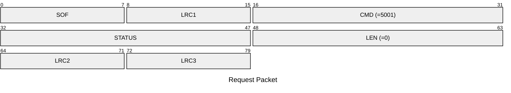
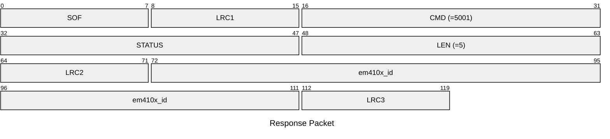

# 5001: EM410X_GET_EMU_ID

Get EM410x ID from emulator.

* CLI: cf `lf em 410x econfig`

## Request Packet

* DATA in Request Packet: None

## Response Packet

* DATA in Response Packet
    * em410x_id: `5 bytes`. The EM410x ID in the emulator.