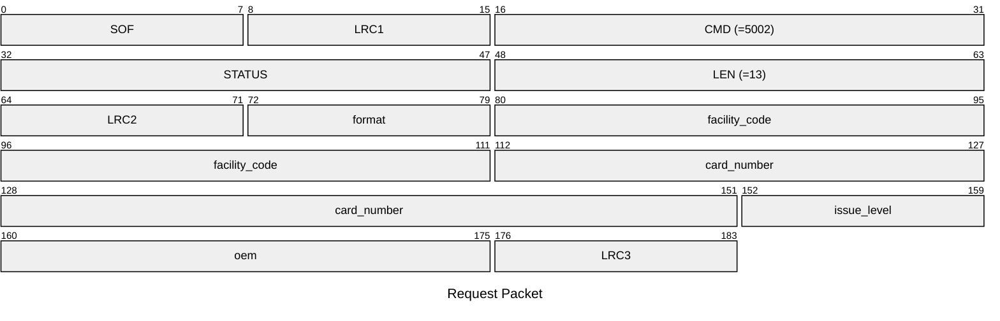
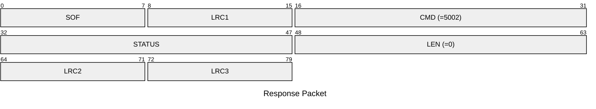

# 5002: HIDPROX_SET_EMU_ID

Set HIDProx ID to emulator.

* CLI: cf `lf hid prox econfig`

## Request Packet

* DATA in Request Packet
    * format: `1 byte`, The format of the HID Prox card.
    * facility_code: `4 bytes`, U32 in network byte order, The facility code of the HID Prox card.
    * card_number: `5 bytes`, U40 in network byte order, The card number of the HID Prox card.
    * issue_level: `1 byte`, The issue level of the HID Prox card.
    * oem: `2 bytes`, The OEM code of the HID Prox card.

## Response Packet

* DATA in Response Packet: None