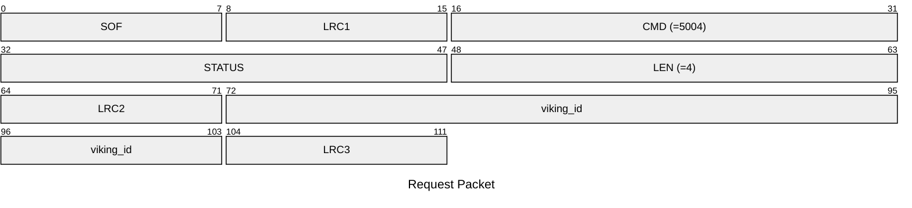
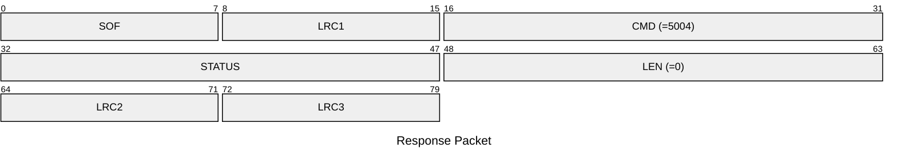

# 5004: VIKING_SET_EMU_ID

Set Viking ID to emulator.

## Request Packet

* DATA in Request Packet
    * viking_id: `4 bytes`. The Viking ID to be emulated.

## Response Packet

* DATA in Response Packet: None