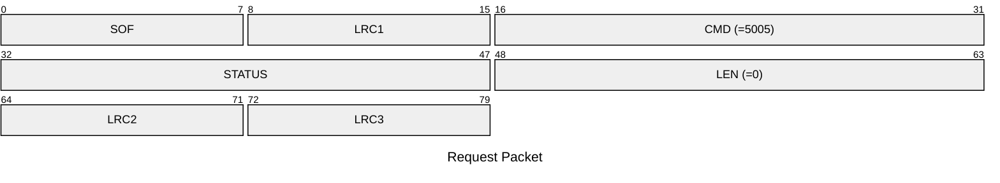
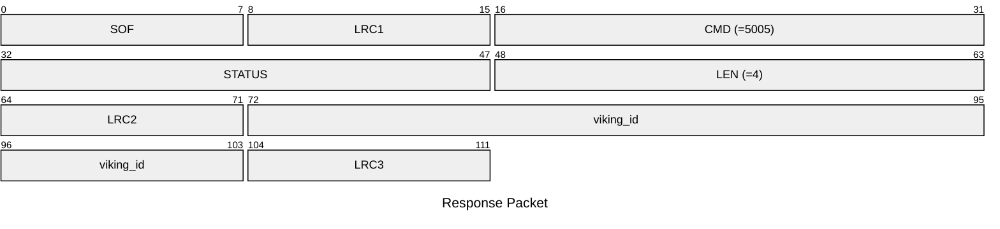

# 5005: VIKING_GET_EMU_ID

Get Viking ID from emulator.

## Request Packet

* DATA in Request Packet: None

## Response Packet

* DATA in Response Packet
    * viking_id: `4 bytes`. The Viking ID in the emulator.