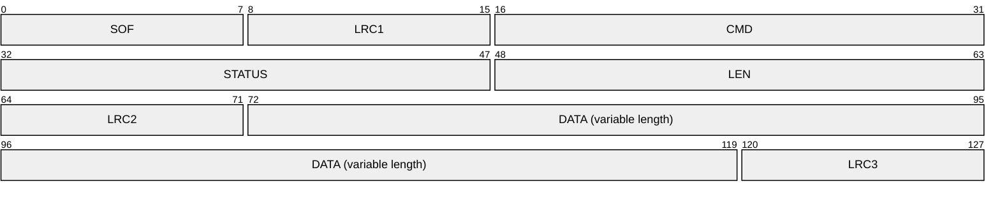

# Protocol description

## Changelog

- 2025/08/12: DATA maxlength changed from 512 to 4096 bytes. ref: [RfidResearchGroup/ChameleonUltra#273](https://github.com/RfidResearchGroup/ChameleonUltra/pull/273)

## Frame format

The communication between the firmware and the client is made of frames structured as follows:

- **SOF**: `1 byte`, "**S**tart-**O**f-**F**rame byte" represents the start of a packet, and must be equal to `0x11`.
- **LRC1**: `1 byte`, LRC over `SOF` byte, therefore must be equal to `0xEF`.
- **CMD**: `2 bytes`, each command have been assigned a unique number (e.g. `DATA_CMD_SET_SLOT_TAG_NICK` = `1007`).
- **STATUS**: `2 bytes`.
  - From client to firmware, the status is always `0x0000`.
  - From firmware to client, the status is the result of the command.
- **LEN**: `2 bytes`, length of the `DATA` field, maximum is `512`.
- **LRC2**: `1 byte`, LRC over `CMD|STATUS|LEN` bytes.
- **DATA**: `LEN bytes`, data to be sent or received, maximum is `512 bytes`. This payload depends on the exact command or response to command being used. See [Packet payloads](#packet-payloads) below.
- **LRC3**: `1 byte`, LRC over `DATA` bytes.

Notes:
* The same frame format is used for commands and for responses.
* All values are **unsigned** values, and if more than one byte, in **network byte order**, aka [Big Endian](https://en.wikipedia.org/wiki/Endianness) byte order.
* The total length of the packet is `LEN + 10` bytes, therefore it is between `10` and `522` bytes.
* The LRC ([**L**ongitudinal **R**edundancy **C**heck](https://en.wikipedia.org/wiki/Longitudinal_redundancy_check)) is the 8-bit two's-complement value of the sum of all bytes modulo $2^8$.
* LRC2 and LRC3 can be computed equally as covering either the frame from its first byte or from the byte following the previous LRC, because previous LRC nullifies previous bytes LRC computation.
E.g. LRC3(DATA) == LRC3(whole frame)

## Command & Data payloads

For the request and response data payload of individual commands, please refer to the following documentation of that specific command.

See [Guidelines](#new-data-payloads-guidelines-for-developers) for add new command and it's data payloads.

Beware, slots in protocol count from 0 to 7 (and from 1 to 8 in the CLI...).

### Device & Slot Related

- [1000: GET_APP_VERSION](./1000.md): **DEPRECATED** Get protocol version.
- [1001: CHANGE_DEVICE_MODE](./1001.md): Change device mode between reader/writer and emulator.
- [1002: GET_DEVICE_MODE](./1002.md): Get current device mode.
- [1003: SET_ACTIVE_SLOT](./1003.md): Set active slot number.
- [1004: SET_SLOT_TAG_TYPE](./1004.md): Set tag type of specific slot.
- [1005: SET_SLOT_DATA_DEFAULT](./1005.md): Reset to tag type's default data of specific slot.
- [1006: SET_SLOT_ENABLE](./1006.md): Enable/disable specific slot HF/LF.
- [1007: SET_SLOT_TAG_NICK](./1007.md): Set nickname of specific slot HF/LF.
- [1008: GET_SLOT_TAG_NICK](./1008.md): Get nickname of specific slot HF/LF.
- [1038: GET_ALL_SLOT_NICKS](./1038.md): Get nickname of all slots HF/LF.
- [1009: SLOT_DATA_CONFIG_SAVE](./1009.md): Save slot data configuration.
- [1010: ENTER_BOOTLOADER](./1010.md): Enter bootloader mode.
- [1011: GET_DEVICE_CHIP_ID](./1011.md): Get device chip ID.
- [1012: GET_DEVICE_ADDRESS](./1012.md): Get device address.
- [1013: SAVE_SETTINGS](./1013.md): Save device settings.
- [1014: RESET_SETTINGS](./1014.md): Reset device settings.
- [1015: SET_ANIMATION_MODE](./1015.md): Set device power on animation.
- [1016: GET_ANIMATION_MODE](./1016.md): Get device power on animation.
- [1017: GET_GIT_VERSION](./1017.md): Get `git describe` version string of source code.
- [1018: GET_ACTIVE_SLOT](./1018.md): Get active slot number.
- [1019: GET_SLOT_INFO](./1019.md): Get information about specific slot.
- [1020: WIPE_FDS](./1020.md): Device factory reset.
- [1021: DELETE_SLOT_TAG_NICK](./1021.md): Delete nickname of specific slot HF/LF.
- [1023: GET_ENABLED_SLOTS](./1023.md): Get enabled/disabled of all slots HF/LF.
- [1024: DELETE_SLOT_SENSE_TYPE](./1024.md): Delete data of specific slot HF/LF.
- [1025: GET_BATTERY_INFO](./1025.md): Get battery voltage and level.
- [1026: GET_BUTTON_PRESS_CONFIG](./1026.md): Get button press function of specific button.
- [1027: SET_BUTTON_PRESS_CONFIG](./1027.md): Set button press function of specific button.
- [1028: GET_LONG_BUTTON_PRESS_CONFIG](./1028.md): Get button long press function of specific button.
- [1029: SET_LONG_BUTTON_PRESS_CONFIG](./1029.md): Set button long press function of specific button.
- [1030: SET_BLE_PAIRING_KEY](./1030.md): Set BLE pairing key.
- [1031: GET_BLE_PAIRING_KEY](./1031.md): Get BLE pairing key.
- [1032: DELETE_ALL_BLE_BONDS](./1032.md): Delete all BLE bonded devices.
- [1033: GET_DEVICE_MODEL](./1033.md): Get device type (Ultra/Lite).
- [1034: GET_DEVICE_SETTINGS](./1034.md): Get device settings.
- [1035: GET_DEVICE_CAPABILITIES](./1035.md): Get supported command IDs.
- [1036: GET_BLE_PAIRING_ENABLE](./1036.md): Get BLE pairing is enabled or not.
- [1037: SET_BLE_PAIRING_ENABLE](./1037.md): Enable/disable BLE pairing.

### High Frequency (HF) Reader/Writer Related

- [2000: HF14A_SCAN](./2000.md): Scan UID, ATQA, SAK, ATS of 14443-3 (Type A) tags.
- [2001: MF1_DETECT_SUPPORT](./2001.md): Detect if tag support Mifare Classic AUTH command or not.
- [2002: MF1_DETECT_PRNG](./2002.md): Detect PRNG type of Mifare Classic tag.
- [2003: MF1_STATIC_NESTED_ACQUIRE](./2003.md): Acquire necessary data from Mifare Classic tag for static nested attack.
- [2004: MF1_DARKSIDE_ACQUIRE](./2004.md): Acquire necessary data from Mifare Classic tag for Darkside attack.
- [2005: MF1_DETECT_NT_DIST](./2005.md): Detect tag nonce distance of Mifare Classic tag.
- [2006: MF1_NESTED_ACQUIRE](./2006.md): Acquire necessary data from Mifare Classic tag for nested attack.
- [2007: MF1_AUTH_ONE_KEY_BLOCK](./2007.md): AUTH specific block and key type of Mifare Classic tag.
- [2008: MF1_READ_ONE_BLOCK](./2008.md): Read specific block of Mifare Classic tag.
- [2009: MF1_WRITE_ONE_BLOCK](./2009.md): Write specific block of Mifare Classic tag.
- [2010: HF14A_RAW](./2010.md): Send raw 14443-3 (Type A) commands with options.
- [2011: MF1_MANIPULATE_VALUE_BLOCK](./2011.md): Manipulate value block of Mifare Classic tag.
- [2012: MF1_CHECK_KEYS_OF_SECTORS](./2012.md): Check keys on sectors of Mifare Classic tag in batch.
- [2013: MF1_HARDNESTED_ACQUIRE](./2013.md): Acquire necessary data from Mifare Classic tag for hardnested attack.
- [2014: MF1_ENC_NESTED_ACQUIRE](./2014.md): Acquire necessary data from Mifare Classic tag for encrypted nested attack.
- [2015: MF1_CHECK_KEYS_ON_BLOCK](./2015.md): Check keys on block of Mifare Classic tag in batch.

### Low Frequency (LF) Reader/Writer Related

- [3000: EM410X_SCAN](./3000.md): Scan ID of EM410x tags.
- [3001: EM410X_WRITE_TO_T55XX](./3001.md): Write EM410x ID to T55xx tag.
- [3002: HIDPROX_SCAN](./3002.md): Scan ID of HIDProx tags.
- [3003: HIDPROX_WRITE_TO_T55XX](./3003.md): Write HIDProx ID to T55xx tag.
- [3004: VIKING_SCAN](./3004.md): Scan ID of Viking tags.
- [3005: VIKING_WRITE_TO_T55XX](./3005.md): Write Viking ID to T55xx tag.

### High Frequency (HF) Emulator Related

- [4000: MF1_WRITE_EMU_BLOCK_DATA](./4000.md): Write block data to Mifare Classic emulator.
- [4001: HF14A_SET_ANTI_COLL_DATA](./4001.md): Set anti-collision data to emulator.
- [4004: MF1_SET_DETECTION_ENABLE](./4004.md): Enable/disable AUTH error logger of Mifare Classic emulator for MFKey32 attack.
- [4005: MF1_GET_DETECTION_COUNT](./4005.md): Get count of AUTH error log of Mifare Classic emulator for MFKey32 attack.
- [4006: MF1_GET_DETECTION_LOG](./4006.md): Get AUTH error log of Mifare Classic emulator for MFKey32 attack.
- [4007: MF1_GET_DETECTION_ENABLE](./4007.md): Get AUTH error logger is enabled or not of Mifare Classic emulator for MFKey32 attack.
- [4008: MF1_READ_EMU_BLOCK_DATA](./4008.md): Read block data from Mifare Classic emulator.
- [4009: MF1_GET_EMULATOR_CONFIG](./4009.md): Get configuration of Mifare Classic emulator.
- [4010: MF1_GET_GEN1A_MODE](./4010.md): Get the Mifare Classic emulator is emulating gen1a magic tag or not.
- [4011: MF1_SET_GEN1A_MODE](./4011.md): Set the Mifare Classic emulator to emulate gen1a magic tag or not.
- [4012: MF1_GET_GEN2_MODE](./4012.md): Get the Mifare Classic emulator is emulating gen2 magic tag or not.
- [4013: MF1_SET_GEN2_MODE](./4013.md): Set the Mifare Classic emulator to emulate gen2 magic tag or not.
- [4014: MF1_GET_BLOCK_ANTI_COLL_MODE](./4014.md): Get the toggle whether to use anti-collision data from emulator block 0 or not.
- [4015: MF1_SET_BLOCK_ANTI_COLL_MODE](./4015.md): Set the toggle whether to use anti-collision data from emulator block 0 or not.
- [4016: MF1_GET_WRITE_MODE](./4016.md): Get the write protect mode of Mifare Classic emulator.
- [4017: MF1_SET_WRITE_MODE](./4017.md): Set the write protect mode of Mifare Classic emulator.
- [4018: HF14A_GET_ANTI_COLL_DATA](./4018.md): Get anti-collision data from emulator.
- [4019: MF0_NTAG_GET_UID_MAGIC_MODE](./4019.md): Get the NTAG emulator is emulating UID magic tag or not.
- [4020: MF0_NTAG_SET_UID_MAGIC_MODE](./4020.md): Set the NTAG emulator to emulate UID magic tag or not.
- [4021: MF0_NTAG_READ_EMU_PAGE_DATA](./4021.md): Read page data from NTAG emulator.
- [4022: MF0_NTAG_WRITE_EMU_PAGE_DATA](./4022.md): Write page data to NTAG emulator.
- [4023: MF0_NTAG_GET_VERSION_DATA](./4023.md): Get NTAG version from NTAG emulator.
- [4024: MF0_NTAG_SET_VERSION_DATA](./4024.md): Set NTAG version to NTAG emulator.
- [4025: MF0_NTAG_GET_SIGNATURE_DATA](./4025.md): Get signature from NTAG emulator.
- [4026: MF0_NTAG_SET_SIGNATURE_DATA](./4026.md): Set signature to NTAG emulator.
- [4027: MF0_NTAG_GET_COUNTER_DATA](./4027.md): Get counter from NTAG emulator.
- [4028: MF0_NTAG_SET_COUNTER_DATA](./4028.md): Set counter to NTAG emulator.
- [4029: MF0_NTAG_RESET_AUTH_CNT](./4029.md): Reset AUTH counter of NTAG emulator.
- [4030: MF0_NTAG_GET_PAGE_COUNT](./4030.md): Get page count of NTAG emulator.
- [4031: MF0_NTAG_GET_WRITE_MODE](./4031.md): Get the protected mode of writing to NTAG emulator.
- [4032: MF0_NTAG_SET_WRITE_MODE](./4032.md): Set the protected mode of writing to NTAG emulator.
- [4033: MF0_NTAG_SET_DETECTION_ENABLE](./4033.md): Enable/disable AUTH logger of NTAG emulator.
- [4034: MF0_NTAG_GET_DETECTION_COUNT](./4034.md): Get AUTH log count of NTAG emulator.
- [4035: MF0_NTAG_GET_DETECTION_LOG](./4035.md): Get AUTH log of NTAG emulator.
- [4036: MF0_NTAG_GET_DETECTION_ENABLE](./4036.md): Get AUTH logger is enabled or not of NTAG emulator.
- [4037: MF0_NTAG_GET_EMULATOR_CONFIG](./4037.md): Get configuration of NTAG emulator.

### Low Frequency (LF) Emulator Related

- [5000: EM410X_SET_EMU_ID](./5000.md): Set EM410x ID to emulator.
- [5001: EM410X_GET_EMU_ID](./5001.md): Get EM410x ID from emulator.
- [5002: HIDPROX_SET_EMU_ID](./5002.md): Set HIDProx ID to emulator.
- [5003: HIDPROX_GET_EMU_ID](./5003.md): Get HIDProx ID from emulator.
- [5004: VIKING_SET_EMU_ID](./5004.md): Set Viking ID to emulator.
- [5005: VIKING_GET_EMU_ID](./5005.md): Get Viking ID from emulator.

## Status

Standard response status is `STATUS_SUCCESS` for general commands, `STATUS_HF_TAG_OK` for HF commands and `STATUS_LF_TAG_OK` for LF commands.

## New data payloads: guidelines for developers

If you need to define new payloads for new commands, try to follow these guidelines.

### Guideline: Verbose and explicit

Be verbose, explicit and reuse conventions, in order to enhance code maintainability and understandability for the other contributors

### Guideline: Structs

- Define C `struct` for cmd/resp data greater than a single byte, use and abuse of `struct.pack`/`struct.unpack` in Python. So one can understand the payload format at a simple glimpse. Exceptions to `C` struct are when the formats are of variable length (but Python `struct` is still flexible enough to cope with such formats!)
- Avoid hardcoding offsets, use `sizeof()`, `offsetof(struct, field)` in C and `struct.calcsize()` in Python
- For complex bitfield structs, exceptionally you can use ctypes in Python. Beware ctypes.BigEndianStructure bitfield will be parsed in the firmware in the reverse order, from LSB to MSB.

### Guideline: Status

If single byte of data to return, still use a 1-byte `data`, not `status`. Standard response status is `STATUS_SUCCESS` for general commands, `STATUS_HF_TAG_OK` for HF commands and `STATUS_LF_TAG_OK` for LF commands. If the response status is different than those, the response data is empty. Response status are generic and cover things like tag disappearance or tag non-conformities with the ISO standard. If a command needs more specific response status, it is added in the first byte of the data, to avoid cluttering the 1-byte general status enum with command-specific statuses. See e.g. [MF1_DARKSIDE_ACQUIRE](#2004-mf1_darkside_acquire).

### Guideline: unambiguous types

- Use unambiguous types such as `uint16_t`, not `int` or `enum`. Cast explicitly `int` and `enum` to `uint_t` of proper size
- Use Network byte order for 16b and 32b integers
  - Macros `U16NTOHS`, `U32NTOHL` must be used on reception of a command payload.
  - Macros `U16HTONS`, `U32HTONL` must be used on creation of a response payload.
  - In Python, use the modifier `!` with all `struct.pack`/`struct.unpack`

### Guideline: payload parsing in handlers

- Concentrate payload parsing in the handlers, avoid further parsing in their callers. Callers should not care about the protocol. This is true for the firmware and the client.
- In cmd_processor handlers: don't reuse input `length`/`data` parameters for creating the response content

### Guideline: Naming conventions

- Use the exact same command and fields names in firmware and in client, use function names matching the command names for their handlers unless there is a very good reason not to do so. This helps grepping around. Names must start with a letter, not a number, because some languages require it (e.g. `14a_scan` not possible in Python)
- Respect commands order in `m_data_cmd_map`, `data_cmd.h` and `chameleon_cmd.py` definitions
- Even if a command is not yet implemented in firmware or in client but a command number is allocated, add it to `data_cmd.h` and `chameleon_cmd.py` with some `FIXME: to be implemented` comment

### Guideline: Validate status and data

- Validate response status in client before parsing data.
- Validate data before using it.

## Room for improvement

* some `num_to_bytes` `bytes_to_num` could use `hton*`, `ntoh*` instead, to make endianess explicit
* some commands are using bitfields (e.g. mf1_get_detection_log (sending directly the flash stored format) and hf14a_raw) while some commands are spreading bits into 0x00/0x01 bytes (e.g. mf1_get_emulator_config)
* describe flash storage formats